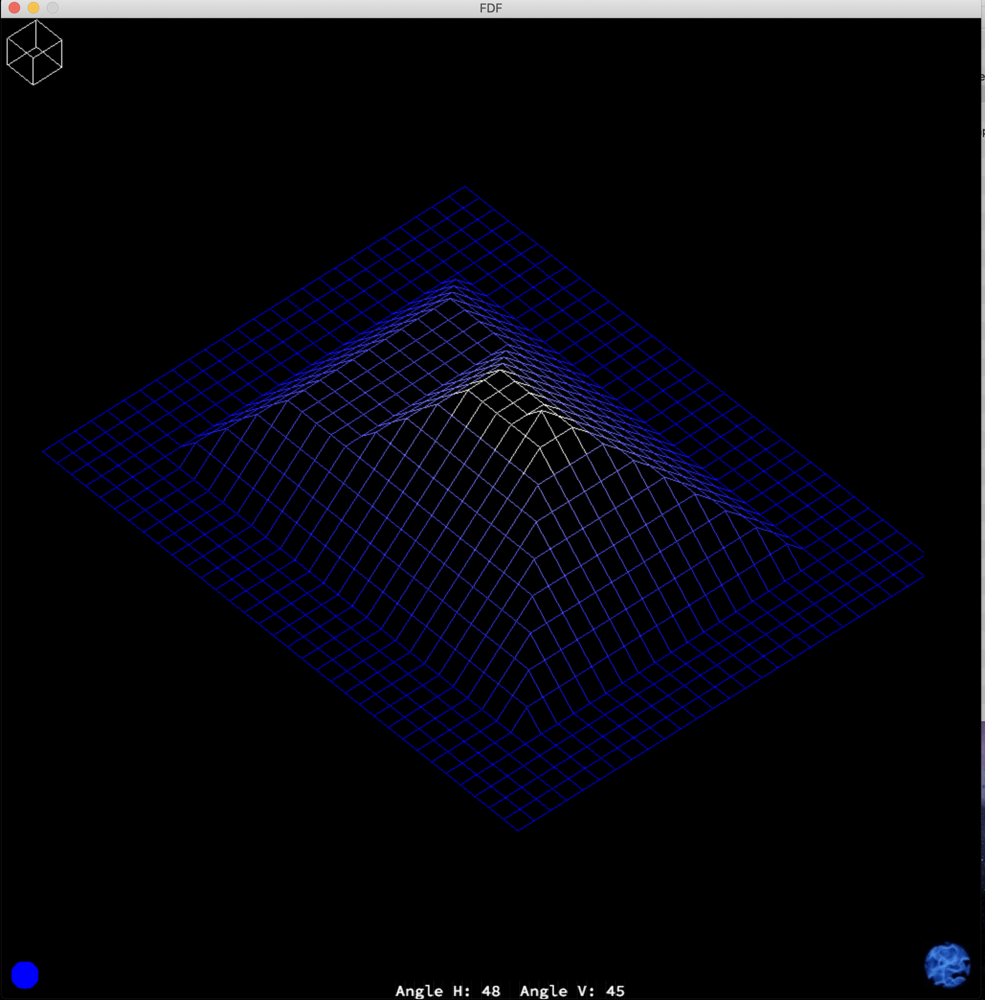
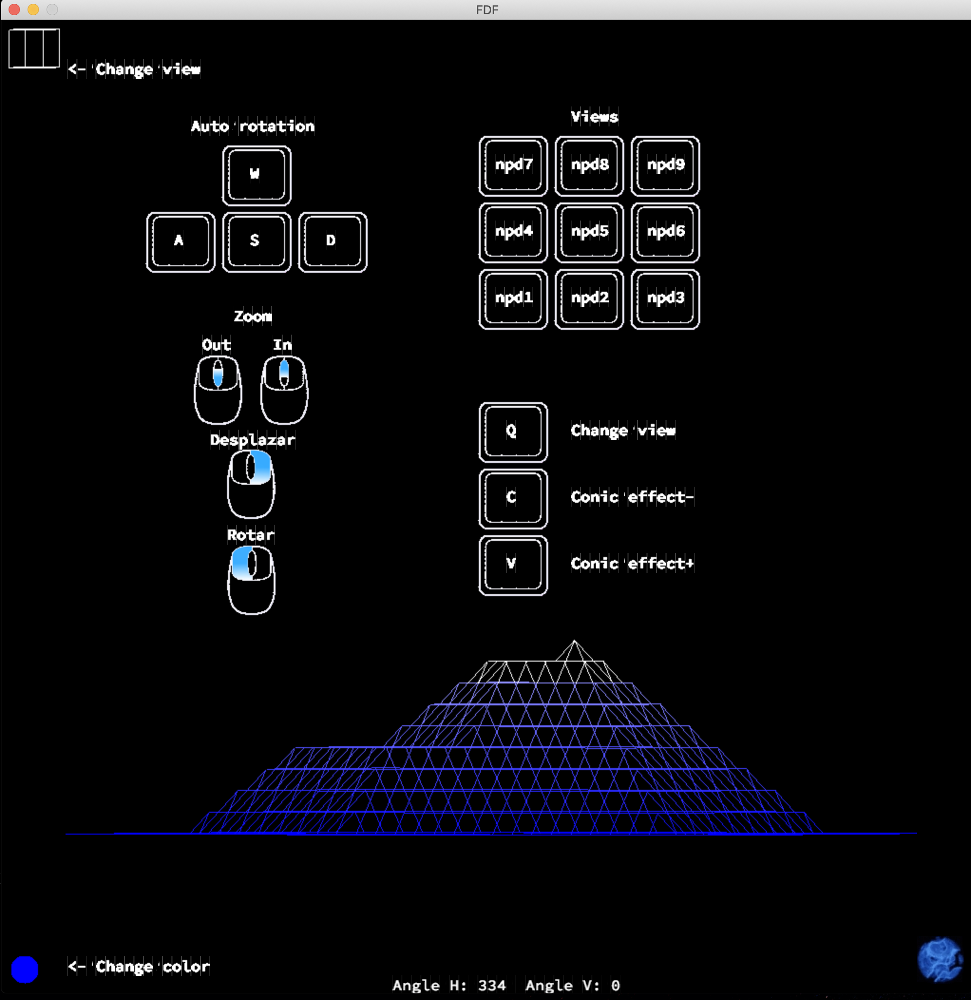
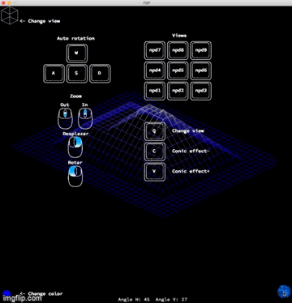
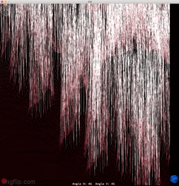

# FDF

A 42 project in which we have to read a map file (with a format similar to ArcGrid) and show it using isometric projection.

To compile the program
```bash
$ make
```

To load a map (there are a few examples on test_maps folder)
```bash
$ ./fdf map.fdf
```


## Interface

Controls can be displayed when your mouse hoover over the blue sphere at the bottom right corner.





Colors can be overwrite using the icon on the botton left corner 

<p align="center">

</p>

Maps can be displayed using polar coordinates (at the time this feature can only be used by changing o few lines of code)


Elevations can be scaled

<p align="center">

</p>
