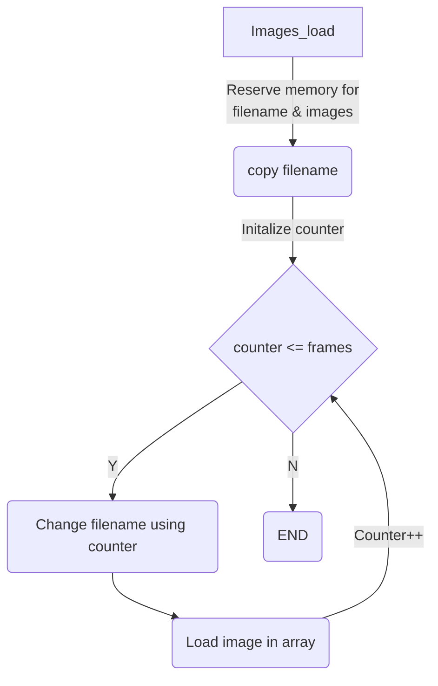

## Image manage
For 42 students doing so_long, there's an easy way to load images and make animations..

Inside ui_images.c theres a function "images_load" that allows you to use miniibx to load up to 100 images and store them into an image array.

